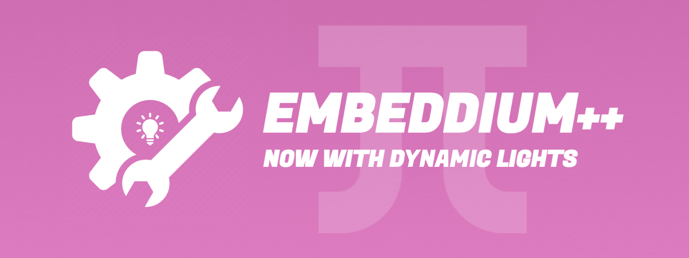

# 
Mod who gives you a plus for embeddium And a reliable fork of [MagnesiumExtras](https://github.com/anthxnymc/MagnesiumExtras)
(and now is embedded [DynamicLights](https://github.com/anthxnymc/DynamicLightsReforged))

## FEATURES
- Embedded DynamicLights (works better with shaders)
- True Darkness (ideal for terror modpacks)
- Entity Distance Rendering Limit (or EntityCulling for friends)
- Fancy FPS Counter (No more F3 to see your FPS)
- Borderless FullScreen (tab faster)
- Fog Toggle (Disable game fog)
- Hide JEI overlay when you are not searching (this time disabled by default)
- ~~ZoomKey~~ (removed in favor of [JustZoom](https://www.curseforge.com/minecraft/mc-mods/just-zoom-forge))
- ~~Chunk Fade In~~ (Missing)

## MISC FEATURES
- Hide game overlay when is showing FPS chart

## WANT SOME SERVER?

## DIFFERENCES WITH OFFICIAL VERSION
- Fixed: Ice and Fire dragons got culled
- Fixed: you can't go back to Windowed after switching into Borderless/FullScreen
- Implemented: fast entities whitelist to be ignored on culling (supports wildcard for name)
- Implemented: Gui configurations are now localized (help translating [here](https://igthub.com/SrRapero720/EmbeddiumPlus/blob/1.20/src/main/resources/assets/embeddiumplus/lang/en_us.json))
- Misc: Code cleanup and optimization
- Misc: More stuff that I forgot :(

# TRANSLATIONS
- 🍜 Simplified Chinese (thanks to Wheatley11 and qznfbnj)
- 🥐 French (thanks to Myuui)
- 🍾 Russia (thanks to CatAndPaste)
- 🌮 Mexican Spanish (thanks to ME, that's right, I am mexican)

## COMMUNITY AND SUPPORT
Join to my [discord](https://discord.gg/cuYAzzZ) and talk directly with me

## CONFIG PREVIEW

## IMPORTANT
Requires EMBEDDIUM